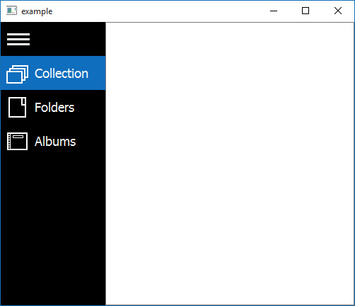

# burger-menu
A basic burger menu widget implementation for Qt.

Menu entries are added as QActions with support for text and icons, like in regular QMenu.  
Burget menu icon is user configurable.  
Menu expansion is optionally animated.  
Signals are provided for all state changes and triggering of the actions.  
Theme is configurable via standard stylesheet box model referring to object names:  
- *#BurgerMenu* - the entire menu widget
- *#BurgerButton* - a single entry on the list
- *#MainBurgerButton* - the burget menu button

An optional Qt Designer plugin is provided to ease integrating this widget with .ui classes, but due to restrictions of designer API actions need to be added from code.

Example look:

